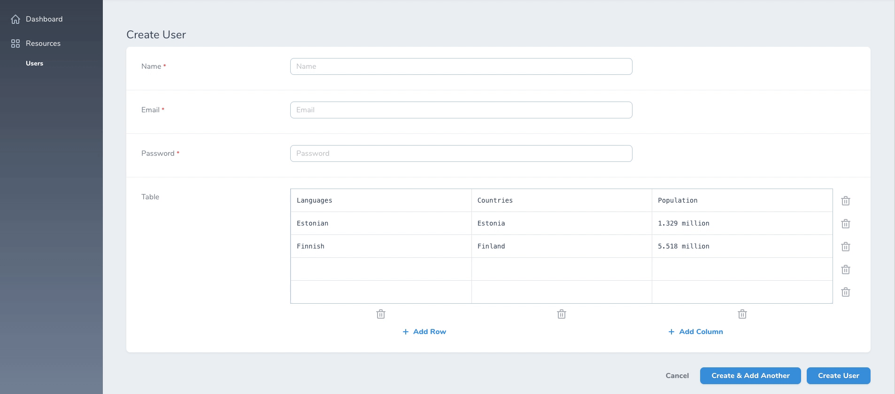

# Nova Table Field

[](https://packagist.org/packages/outl1ne/nova-table-field)
[](https://packagist.org/packages/outl1ne/nova-table-field)

Simple [Laravel Nova](https://nova.laravel.com) Table field.


### Form View




## Installation

Install the package in a Laravel Nova project via Composer:

```bash
composer require outl1ne/nova-table-field
```

## Usage

The `Table` field provides a convenient interface to edit rows and columns stored inside `JSON` equivalent column.
```php
use Outl1ne\NovaTableField\Table;

public function fields(Request $request)
{
    return [
        Table::make('Countries')

        // Optional:
        ->disableAdding() // Disable adding new rows and columns
        ->disableDeleting() // Disable deleting rows and columns
        ->minRows(1) // The minimum number of rows in the table
        ->maxRows(10) // The maximum number of rows in the table
        ->minColumns(1) // The minimum number of columns in the table
        ->maxColumns(10) // The maximum number of columns in the table
        ->defaultValues([ // Default values for new rows
            ['column_1', 'column_2'], // This is a row
            ['column_3', 'column_4'], // This is a row
        ])
    ];
}
```

Note that you also have to cast the `JSON` data to `array` in your model
```
protected $casts = ['countries' => 'array'];
```

## Localization

The translations file can be published by using the following publish command:

```bash
php artisan vendor:publish --provider="Outl1ne\NovaTableField\FieldServiceProvider" --tag="translations"
```

You can then edit the strings to your liking.
